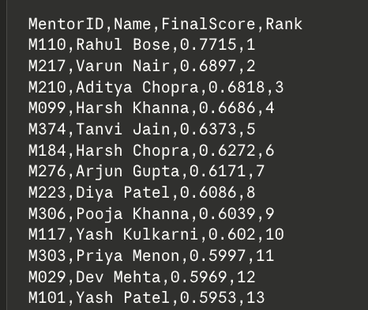
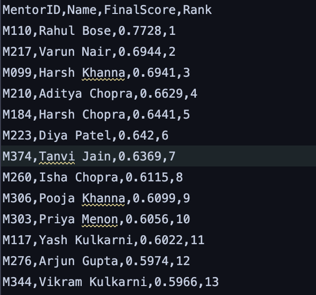

# Mentor Scoring System Ideation

## 1. Goal

The aim is to evaluate mentor effectiveness using multiple signals together. A single raw count like meetings or feedback alone is not enough, so I combined 4 components into one final score:

`
M(m) = w1*P + w2*R + w3*E + w4*F
`

with:
`
w1 = 0.40, w2 = 0.30, w3 = 0.15, w4 = 0.15
`

These weights add up to 1. I gave maximum importance to actual student progress and timely mentor support, while keeping engagement and feedback as secondary but still useful signals.

## 2. Student Progress Score (P)

The basic metric given in the problem is:

```text
P = total milestones completed by mentees / total milestones assigned
```

I extended this by giving later milestones more weight, because finishing milestone 5 usually means more than finishing milestone 1.

### 2.1 Weighted milestone design

Let milestone `i` have weight `i`.
So if a student has completed `k` milestones, weighted completed value becomes:

```text
1 + 2 + 3 ..... + k = k*(k+1)/2
```

And if total milestones assigned are `T`, weighted total becomes:

```text
1 + 2 + ... + T = T*(T+1)/2
```

So for each student:

```text
weighted_completed = MilestonesCompleted * (MilestonesCompleted + 1) / 2
weighted_total     = TotalMilestones * (TotalMilestones + 1) / 2
```

For each mentor:

```text
P = sum(weighted_completed over all mentees) / sum(weighted_total over all mentees)
```

### 2.2 Assumption

This assumes milestones are completed in order. So if a student completed `k` milestones, I assume they completed milestones 1 to k .

I had to make this assumption because the dataset only gives the number of completed milestones, not which exact milestones were completed.

### 2.3 Shared students

Some students have multiple mentors. In that case, both mentors get full credit for that student's progress.
I chose this because the dataset does not tell which mentor contributed how much. Splitting credit would just be another arbitrary assumption.

## 3. Responsiveness Score (R)

The problem asks for a function of response time such that:

- faster replies get higher score
- very slow replies are strongly penalized
- score stays in [0,1]

I used a piecewise Hill function (sigmoidal) instead of simple exponential decay.

### 3.1 Why Hill instead of exponential

An exponential function starts penalizing immediately from time 0 , for this setting it doesn't work well.

For example, replying in 1 hour vs 3 hour should not make a big difference between two good mentors. What matters more is when response time crosses a threshold where project momentum starts getting affected.

That is why Hill function felt better. It gives:

- almost full score for very fast replies
- moderate penalty for normal delays
- sharp drop after delay becomes too much

### 3.2 Functional form

Let `t` be response time in hours. Then:

```
R(t) = 1, if t <= 4
R(t) = 1 / (1 + ((t - 4)/tau)^k), if t > 4
```

I used a 4-hour grace period because mentors here are IIT student seniors, not full-time professionals. Students need reasonably quick replies to keep moving.

### 3.3 Calibration

I chose:
- `R(12) = 0.5`
- `R(24) = 0.05`

Interpretation:
- 12 hours means half a day is lost, so acceptable but not good
- 24 hours means almost a full day is lost, so poor in this context

Now solving algebraically we get:

At `t = 12`:
```text
k = ln(19) / ln(2.5) ≈ 3.2134
```

So final function becomes:

```text
R(t) = 1, for t <= 4
R(t) = 1 / (1 + ((t - 4)/8)^3.2134), for t > 4
```

### 3.4 Aggregation of the choice

The problem statement talks about average response time per mentor. But in the actual CSV, `AvgResponseTime` is already given for each mentor-student pair.

*So instead of first averaging response times and then applying the function, I first computed `R(t)` for each pair and then averaged those scores for each mentor.*

I preferred this because the function is nonlinear. If a mentor replies very fast to one student but very slowly to another, taking just one average response time can hide that inconsistency for one student . Pairwise scoring captures this better.

## 4. Engagement Score (E)

Engagement should capture how actively a mentor interacted with students.

### 4.1 Raw engagement

For each mentor-student pair:

```text
E_raw = 0.5 * Meetings + 0.3 * CodeReviews + 0.2 * Messages
```

Why these weights:
- Meetings get highest weight because they take high effort and time.
- Code reviews come next because they directly help student work.
- Messages get lowest weight because they are easiest to inflate.

### 4.2 Per-mentee normalization

Mentors have different numbers of students, so raw totals would be unfair.

So I used:

```
E_per_mentee = sum(E_raw over all mentees) / number of unique students mentored
```

This value has no  upper bound, so I scaled it to `[0,1]` using min-max normalization:

```
E = (E_per_mentee - E_min) / (E_max - E_min)
```

## 5. Mentee Feedback Score (F)

Feedback is useful, but it is noisy. A mentor with just one rating of 5 should not automatically get a perfect score. Also, some ratings may be biased.

So I handled this in 2 stages.

### 5.1 Outlier down-weighting

For each mentor, I computed z-scores of ratings:

```text
z_i = |r_i - r bar| / sigma
```

If `|z_i| > 2`, I  reduced its weight to `0.5` instead of deleting it.

This is only done when mentor has at least 3 ratings, because for very small sample size z-score is not meaningful.

After that, I did Bayesian smoothing of  mentor's rating toward the global mean:

```
F_smooth = (n * r_bar_weighted + k * mu) / (n + k)
```

Where:

- `n` = number of ratings for that mentor
- `r_bar_weighted` = average rating after outlier down-weighting
- `mu` = global average rating across all mentors
- `k = 3` = prior strength

Interpretation: this is like saying the prior is worth 3 extra ratings at the global average. This prevents very few ratings from giving extreme values.

### 5.2 Scaling

Ratings are on 1 to 5 , so I scaled them to [0,1]:

```text
F = (F_smooth - 1) / 4
```

## 6. Final Weights

Final score is:

```text
M(m) = 0.40P + 0.30R + 0.15E + 0.15F
```

### 6.1 Justification

- `P = 0.40`: most important, because final goal of mentorship is helping students actually complete work
- `R = 0.30`: next most important, because slow replies directly block student progress
- `E = 0.15`: still useful, but raw activity alone should not dominate score
- `F = 0.15`: useful signal, but more subjective and noisier than observed outcome and response behavior

So overall I gave highest priority to outcome and unblockability, while still keeping support effort and student perception in the score.

### 6.2 Correlation check

Initially I thought of choosing weights mainly from intuition. But after that I also did a technical sanity check using correlations between score components in the dataset.

I computed:

- `corr(E, P) ≈ -0.035`
- `corr(F, P) ≈ -0.014`
- `corr(F, E) ≈ 0.479`

This suggests that in this dataset ,
- engagement has almost no relationship with actual progress
- feedback is more aligned with engagement/perceived support than with milestone completion

Because of this, I reduced the weights of `E` and `F`, and increased the importance of `P` and `R`.

So the overall weight change is:

- Old weights: `P=0.35, R=0.25, E=0.20, F=0.20`




- New weights: `P=0.40, R=0.30, E=0.15, F=0.15`



- Still kept E and F in the final score because they capture real mentorship qualities.

## 7. Score Evolution Over Time

The dataset does not contain timestamps, so this part is theoretical only.

I used exponential smoothing:

```text
M_(t+1) = (1 - alpha) * M_t + alpha * M_current
```

with alpha = 0.3

This means:
- recent performance gets 30% weight
- past performance keeps 70% weight

So the score changes gradually and does not become too violatile.
I considered one evaluation period to be one week, which matches the assignment's clarification.

## 8. Activity Decay

If a mentor has no interactions for 2 consecutive evaluation periods, decay applies:

```text
M_new = M_old * (1 - d)
```

with:

```text
d = 0.10
```

So after the inactivity threshold, score drops by 10% per inactive period.

I chose 10% because it is noticeable, not catastrophic so that mentor who becomes active again can still recover.

Assumption: I define "inactive" as zero engagement activity in that week's interaction i.e. zero meetings, code reviews, and messages.

## 9. Normalization Across Mentors

The main fairness issue is that mentors have different numbers of students. My normalization choices are:

- `P` is already a ratio, so it naturally scales
- `R` is averaged across mentor-student responsiveness scores, not taken as a raw total
- `E` is divided by number of unique mentees before scaling
- `F` is per mentor, and Bayesian smoothing handles small sample sizes

So mentors with larger groups are not automatically rewarded or penalized just because they have more students.

## 10. Bonus Features are covered

###  Multiple Project Participation

The dataset gives mentor project lists, but the actual working mentor-student relationship is best captured through `interactions.csv`.

So I treated a mentor as supervising a student if that `(MentorID, StudentID)` pair appears in `interactions.csv`.

This naturally handles mentors working across multiple projects:

- `P` aggregates progress over all supervised students
- `R` averages responsiveness over all supervised students
- `E` combines activity but normalizes it per mentee
- `F` uses ratings from all supervised students

So mentors are not unfairly rewarded or penalized for just being involved in more than one project.

### Detecting Unfair Feedback

This is handled directly in feedback scoring:
- compute z-scores within each mentor's ratings
- if `|z| > 2`, mark that rating as suspicious
- reduce its weight to `0.5`

This way I do not completely throw away the rating, but I reduce its effect if it looks biased.

## 11. Assumptions

- `MentorID` and `StudentID` are the only reliable join keys because names are repeative in csv files data.
- a mentor-student mentoring relation exists if that pair appears in `interactions.csv`.
- milestone completion is sequential
- shared students give full progress credit to each mentor
- mentors with no observed interaction or feedback get zero for missing components
- time-evolution and decay sections are all  theoretical because timestamps are not available

## 12. Few Limitations

- The dataset is over the whole project duration, time-based behavior cannot be measured.
- Feedback may still reflect the perceived effort and mentor's friendliness to mentees rather than actual outcome.